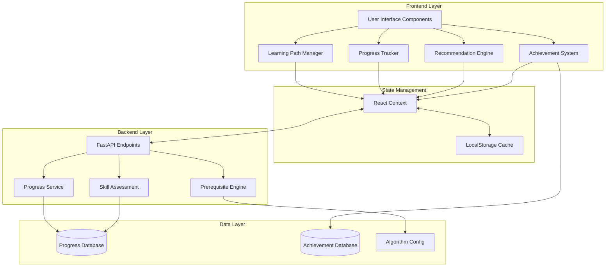

# Design Document: Student Learning Path

## Overview

The Student Learning Path system transforms the ML algorithm learning platform into a structured, progressive educational experience. The design implements a comprehensive learning management system that guides students from beginner to advanced ML concepts through prerequisite enforcement, progress tracking, personalized recommendations, and achievement-based motivation.

### Key Design Principles

1. **Progressive Disclosure**: Students access content incrementally based on demonstrated mastery
2. **Data-Driven Personalization**: Recommendations adapt to individual learning patterns and performance
3. **Persistent State Management**: All progress persists across sessions and devices
4. **Non-Blocking UX**: UI remains responsive while progress syncs asynchronously
5. **Accessibility First**: All features support keyboard navigation, screen readers, and WCAG 2.1 AA compliance

### Technology Stack

- **Frontend**: Next.js 14, React 18, TypeScript, Tailwind CSS
- **State Management**: React Context API with localStorage persistence
- **Backend**: Python FastAPI (existing)
- **Database**: JSON file storage (existing pattern) or SQLite for structured progress data
- **Authentication**: Session-based (to be integrated with existing auth if present)

## Architecture

### System Components



### Data Flow

1. **User Action** → UI Component captures interaction (e.g., complete algorithm step)
2. **State Update** → Progress Tracker updates React Context
3. **Optimistic UI** → UI immediately reflects change
4. **Persistence** → Context syncs to localStorage (immediate) and backend API (async)
5. **Validation** → Prerequisite Engine validates unlocks
6. **Recommendation** → Recommendation Engine recalculates next steps
7. **Notification** → Achievement System checks for new badges

## Components and Interfaces

### 1. Learning Path Manager

**Responsibility**: Orchestrates overall learning path logic, manages algorithm access control

**Interface**:
```typescript
interface LearningPathManager {
  // Algorithm access control
  isAlgorithmUnlocked(algorithmId: string): boolean;
  getLockedReason(algorithmId: string): string;
  unlockAlgorithm(algorithmId: string): void;
  
  // Difficulty level management
  getCurrentDifficultyLevel(): DifficultyLevel;
  isDifficultyLevelUnlocked(level: DifficultyLevel): boolean;
  
  // Navigation guards
  canNavigateToAlgorithm(algorithmId: string): NavigationResult;
  getAlgorithmsByDifficulty(level: DifficultyLevel): Algorithm[];
}

type DifficultyLevel = 'Beginner' | 'Intermediate' | 'Advanced';

interface NavigationResult {
  allowed: boolean;
  reason?: string;
  missingPrerequisites?: string[];
}

interface Algorithm {
  id: string;
  name: string;
  difficulty: DifficultyLevel;
  prerequisites: string[];
  category: string;
  mathFocus: string;
}
```

**Implementation Notes**:
- Maintains algorithm configuration with prerequisite relationships
- Queries Progress Tracker for completion status
- Implements prerequisite validation logic
- Provides navigation guard hooks for Next.js routing

### 2. Progress Tracker

**Responsibility**: Records and retrieves student progress across all algorithms and steps

**Interface**:
```typescript
interface ProgressTracker {
  // Step-level progress
  markStepComplete(algorithmId: string, step: WorkflowStep): void;
  isStepComplete(algorithmId: string, step: WorkflowStep): boolean;
  getStepProgress(algorithmId: string): StepProgress;
  
  // Algorithm-level progress
  getAlgorithmStatus(algorithmId: string): MasteryStatus;
  getAlgorithmCompletionPercentage(algorithmId: string): number;
  
  // Overall progress
  getOverallProgress(): OverallProgress;
  getTotalCompletedAlgorithms(): number;
  
  // Persistence
  syncProgress(): Promise<void>;
  loadProgress(): Promise<void>;
}

type WorkflowStep = 
  | 'theory' 
  | 'dataset' 
  | 'eda' 
  | 'preprocessing' 
  | 'feature_engineering' 
  | 'train_evaluate';

type MasteryStatus = 
  | 'not_started' 
  | 'in_progress' 
  | 'completed' 
  | 'mastered';

interface StepProgress {
  theory: boolean;
  dataset: boolean;
  eda: boolean;
  preprocessing: boolean;
  feature_engineering: boolean;
  train_evaluate: boolean;
}

interface OverallProgress {
  totalSteps: number;
  completedSteps: number;
  percentage: number;
  algorithmProgress: Map<string, AlgorithmProgress>;
}

interface AlgorithmProgress {
  algorithmId: string;
  status: MasteryStatus;
  completedSteps: WorkflowStep[];
  completionPercentage: number;
  lastAccessedDate: Date;
  challengeCompleted: boolean;
}
```

**Implementation Notes**:
- Uses React Context for in-memory state
- Persists to localStorage immediately on every change
- Debounces backend API calls (500ms) to reduce server load
- Implements optimistic updates with rollback on API failure
- Stores timestamps for analytics and streak tracking

### 3. Prerequisite Engine

**Responsibility**: Defines and validates prerequisite relationships between algorithms

**Interface**:
```typescript
interface PrerequisiteEngine {
  // Prerequisite validation
  getPrerequisites(algorithmId: string): string[];
  arePrerequisitesMet(algorithmId: string): boolean;
  getMissingPrerequisites(algorithmId: string): Algorithm[];
  
  // Dependency graph
  getDependencyGraph(): DependencyGraph;
  getUnlockedAlgorithms(): string[];
  
  // Unlock notifications
  checkForNewUnlocks(completedAlgorithmId: string): string[];
}

interface DependencyGraph {
  nodes: Algorithm[];
  edges: PrerequisiteEdge[];
}

interface PrerequisiteEdge {
  from: string; // prerequisite algorithm ID
  to: string;   // dependent algorithm ID
}
```

**Prerequisite Rules**:
```typescript
const ALGORITHM_PREREQUISITES: Record<string, string[]> = {
  // Beginner algorithms - no prerequisites
  'linear_regression': [],
  'logistic_regression': [],
  'knn': [],
  'kmeans': [],
  'naive_bayes': [],
  
  // Intermediate algorithms - require all Beginner completed
  'decision_tree': ['linear_regression', 'logistic_regression', 'knn', 'kmeans', 'naive_bayes'],
  'svm': ['linear_regression', 'logistic_regression', 'knn', 'kmeans', 'naive_bayes'],
  
  // Advanced algorithms - require all Intermediate completed
  'ann': ['decision_tree', 'svm'],
  'cnn': ['decision_tree', 'svm'],
  'rnn': ['decision_tree', 'svm'],
  'transformer': ['decision_tree', 'svm'],
};
```

**Implementation Notes**:
- Prerequisite configuration stored in static TypeScript constant
- Validates prerequisites in real-time using Progress Tracker data
- Implements topological sort for dependency visualization
- Caches validation results with cache invalidation on progress updates

### 4. Recommendation Engine

**Responsibility**: Suggests next learning steps based on progress and performance

**Interface**:
```typescript
interface RecommendationEngine {
  // Next step recommendations
  getNextRecommendation(): Recommendation;
  getRecommendationReason(algorithmId: string): string;
  
  // Personalized suggestions
  getSuggestedAlgorithms(count: number): Algorithm[];
  shouldReviewAlgorithm(algorithmId: string): boolean;
  
  // Adaptive difficulty
  getRecommendedDifficulty(): DifficultyLevel;
  shouldSuggestAdvancedContent(): boolean;
}

interface Recommendation {
  type: 'algorithm' | 'challenge' | 'review';
  algorithmId?: string;
  challengeId?: string;
  reason: string;
  priority: 'high' | 'medium' | 'low';
}
```

**Recommendation Logic**:
1. **Priority 1**: Continue in-progress algorithm (if any)
2. **Priority 2**: Complete remaining algorithms in current difficulty level
3. **Priority 3**: Attempt practice challenge for completed algorithms
4. **Priority 4**: Unlock next difficulty level
5. **Priority 5**: Review algorithms with low performance scores

**Implementation Notes**:
- Stateless pure functions for testability
- Considers completion status, time since last access, and challenge performance
- Implements simple scoring algorithm (can be enhanced with ML later)
- Returns human-readable reasons for transparency

### 5. Onboarding Flow Manager

**Responsibility**: Manages first-time user tutorial and guided introduction

**Interface**:
```typescript
interface OnboardingFlowManager {
  // Onboarding state
  isOnboardingComplete(): boolean;
  startOnboarding(): void;
  skipOnboarding(): void;
  pauseOnboarding(): void;
  resumeOnboarding(): void;
  
  // Tutorial steps
  getCurrentStep(): OnboardingStep;
  advanceToNextStep(): void;
  goToPreviousStep(): void;
  
  // Tutorial control
  restartTutorial(): void;
  markOnboardingComplete(): void;
}

interface OnboardingStep {
  id: string;
  title: string;
  description: string;
  targetElement?: string; // CSS selector for highlighting
  position: 'top' | 'bottom' | 'left' | 'right';
  action?: 'click' | 'scroll' | 'none';
}
```

**Onboarding Steps**:
1. Welcome message and platform overview
2. Algorithm grid navigation explanation
3. Difficulty levels and prerequisites introduction
4. 6-step workflow walkthrough
5. Progress tracking demonstration
6. Practice challenges explanation
7. Achievement system preview
8. Dashboard tour

**Implementation Notes**:
- Uses React Portal for overlay tooltips
- Highlights target elements with z-index manipulation and spotlight effect
- Stores onboarding state in localStorage and backend
- Allows skip at any time without penalty
- Provides "Restart Tutorial" option in user settings

### 6. Achievement System

**Responsibility**: Manages badges, milestones, and motivational rewards

**Interface**:
```typescript
interface AchievementSystem {
  // Achievement queries
  getEarnedAchievements(): Achievement[];
  getLockedAchievements(): Achievement[];
  getAchievementProgress(achievementId: string): number;
  
  // Achievement checks
  checkForNewAchievements(): Achievement[];
  awardAchievement(achievementId: string): void;
  
  // Points and stats
  getTotalPoints(): number;
  getCurrentStreak(): number;
  getLearningStats(): LearningStats;
  
  // Certificates
  generateCertificate(type: CertificateType): Certificate;
  getCertificates(): Certificate[];
}

interface Achievement {
  id: string;
  title: string;
  description: string;
  icon: string;
  points: number;
  category: 'milestone' | 'streak' | 'mastery' | 'challenge';
  unlockCondition: string;
  earnedDate?: Date;
}

interface LearningStats {
  totalAlgorithmsCompleted: number;
  totalStepsCompleted: number;
  totalChallengesCompleted: number;
  currentStreak: number;
  longestStreak: number;
  totalTimeSpent: number; // minutes
  averageCompletionTime: number; // minutes per algorithm
}

type CertificateType = 
  | 'beginner_complete' 
  | 'intermediate_complete' 
  | 'advanced_complete' 
  | 'master_complete';

interface Certificate {
  id: string;
  type: CertificateType;
  studentName: string;
  issueDate: Date;
  certificateNumber: string;
  downloadUrl: string;
  shareUrl: string;
}
```

**Achievement Definitions**:
```typescript
const ACHIEVEMENTS: Achievement[] = [
  {
    id: 'first_steps',
    title: 'First Steps',
    description: 'Complete your first algorithm',
    icon: '🎯',
    points: 10,
    category: 'milestone',
    unlockCondition: 'Complete 1 algorithm'
  },
  {
    id: 'beginner_master',
    title: 'Beginner Master',
    description: 'Complete all Beginner algorithms',
    icon: '🌟',
    points: 50,
    category: 'mastery',
    unlockCondition: 'Complete all 5 Beginner algorithms'
  },
  {
    id: 'intermediate_expert',
    title: 'Intermediate Expert',
    description: 'Complete all Intermediate algorithms',
    icon: '⚡',
    points: 100,
    category: 'mastery',
    unlockCondition: 'Complete all 2 Intermediate algorithms'
  },
  {
    id: 'advanced_guru',
    title: 'Advanced Guru',
    description: 'Complete all Advanced algorithms',
    icon: '🚀',
    points: 200,
    category: 'mastery',
    unlockCondition: 'Complete all 4 Advanced algorithms'
  },
  {
    id: 'week_streak',
    title: 'Week Warrior',
    description: 'Learn for 7 consecutive days',
    icon: '🔥',
    points: 30,
    category: 'streak',
    unlockCondition: 'Maintain 7-day streak'
  },
  {
    id: 'challenge_champion',
    title: 'Challenge Champion',
    description: 'Complete 10 practice challenges',
    icon: '🏆',
    points: 75,
    category: 'challenge',
    unlockCondition: 'Complete 10 challenges'
  }
];
```

**Implementation Notes**:
- Checks for new achievements after every progress update
- Displays celebratory modal with animation on achievement unlock
- Generates certificates as PDF using browser print API or PDF library
- Implements shareable certificate URLs with verification codes
- Tracks daily activity for streak calculation

### 7. Skill Assessment Manager

**Responsibility**: Evaluates student performance on practice challenges

**Interface**:
```typescript
interface SkillAssessmentManager {
  // Challenge management
  getChallengeForAlgorithm(algorithmId: string): Challenge;
  submitChallengeResponse(challengeId: string, response: ChallengeResponse): AssessmentResult;
  
  // Performance tracking
  getChallengeHistory(algorithmId: string): ChallengeAttempt[];
  getPerformanceScore(algorithmId: string): number;
  
  // Adaptive difficulty
  shouldSuggestReview(algorithmId: string): boolean;
  shouldSuggestAdvancedContent(): boolean;
}

interface Challenge {
  id: string;
  algorithmId: string;
  type: 'multiple_choice' | 'code' | 'parameter_tuning';
  question: string;
  options?: string[];
  correctAnswer: string;
  hints: string[];
  difficulty: 'easy' | 'medium' | 'hard';
}

interface ChallengeResponse {
  challengeId: string;
  answer: string;
  timeSpent: number; // seconds
}

interface AssessmentResult {
  correct: boolean;
  score: number;
  feedback: string;
  hints?: string[];
  explanation: string;
}

interface ChallengeAttempt {
  challengeId: string;
  algorithmId: string;
  timestamp: Date;
  correct: boolean;
  timeSpent: number;
  hintsUsed: number;
}
```

**Assessment Logic**:
- **Fast + Correct**: High performance, suggest advanced content
- **Slow + Correct**: Adequate performance, continue normal path
- **Fast + Incorrect**: Suggest reviewing concepts
- **Slow + Incorrect**: Suggest reviewing prerequisites

**Implementation Notes**:
- Stores challenge definitions in JSON configuration files
- Validates responses on backend to prevent cheating
- Provides immediate feedback with explanations
- Tracks performance metrics for adaptive recommendations
- Allows unlimited retries without penalty

### 8. Learning Dashboard Component

**Responsibility**: Displays personalized overview of student progress and recommendations

**Interface**:
```typescript
interface LearningDashboard {
  // Dashboard data
  getDashboardData(): DashboardData;
  refreshDashboard(): Promise<void>;
}

interface DashboardData {
  overallProgress: OverallProgress;
  nextRecommendation: Recommendation;
  recentActivity: ActivityItem[];
  earnedAchievements: Achievement[];
  learningStats: LearningStats;
  algorithmsByDifficulty: {
    beginner: AlgorithmProgress[];
    intermediate: AlgorithmProgress[];
    advanced: AlgorithmProgress[];
  };
}

interface ActivityItem {
  type: 'algorithm_complete' | 'step_complete' | 'challenge_complete' | 'achievement_earned';
  timestamp: Date;
  description: string;
  algorithmId?: string;
  achievementId?: string;
}
```

**Dashboard Layout**:
```
┌─────────────────────────────────────────────────────────┐
│  Welcome Back, [Student Name]!                          │
│  Overall Progress: [Circular Progress: 45%]             │
│                                                          │
│  ┌──────────────────────────────────────────┐          │
│  │  Continue Learning                        │          │
│  │  → Linear Regression (Step 3 of 6)       │          │
│  │  [Continue Button]                        │          │
│  └──────────────────────────────────────────┘          │
│                                                          │
│  ┌─────────────┬─────────────┬─────────────┐          │
│  │ Algorithms  │ Challenges  │ Streak      │          │
│  │ 5/11        │ 3/11        │ 7 days 🔥   │          │
│  └─────────────┴─────────────┴─────────────┘          │
│                                                          │
│  Beginner Algorithms [5/5 Complete] ✓                  │
│  [Progress bars for each algorithm]                     │
│                                                          │
│  Intermediate Algorithms [0/2 Complete] 🔒             │
│  [Locked indicators]                                    │
│                                                          │
│  Recent Achievements                                    │
│  [Badge icons with titles]                              │
│                                                          │
│  Learning Path Map                                      │
│  [Visual dependency graph]                              │
└─────────────────────────────────────────────────────────┘
```

**Implementation Notes**:
- Implements as dedicated Next.js page route: `/dashboard`
- Uses React Query for data fetching and caching
- Implements skeleton loaders for async data
- Responsive design with mobile-first approach
- Provides quick navigation to in-progress algorithms

## Data Models

### Progress Data Schema

```typescript
interface StudentProgress {
  studentId: string;
  onboardingComplete: boolean;
  lastAccessDate: Date;
  totalTimeSpent: number; // minutes
  
  algorithmProgress: {
    [algorithmId: string]: {
      status: MasteryStatus;
      completedSteps: WorkflowStep[];
      completionPercentage: number;
      lastAccessedDate: Date;
      timeSpent: number; // minutes
      challengeAttempts: ChallengeAttempt[];
      challengeCompleted: boolean;
    };
  };
  
  achievements: {
    [achievementId: string]: {
      earnedDate: Date;
      points: number;
    };
  };
  
  dailyActivity: {
    [date: string]: { // YYYY-MM-DD format
      stepsCompleted: number;
      timeSpent: number;
      algorithmsAccessed: string[];
    };
  };
  
  certificates: Certificate[];
}
```

### Algorithm Configuration Schema

```typescript
interface AlgorithmConfig {
  algorithms: {
    [algorithmId: string]: {
      id: string;
      name: string;
      difficulty: DifficultyLevel;
      category: string;
      mathFocus: string;
      prerequisites: string[];
      estimatedTime: number; // minutes
      steps: {
        [step in WorkflowStep]: {
          title: string;
          description: string;
          estimatedTime: number;
        };
      };
    };
  };
}
```

### Storage Strategy

**LocalStorage** (Immediate persistence):
- Current progress state
- Onboarding status
- UI preferences
- Cache TTL: Sync with backend every 5 minutes or on visibility change

**Backend Database** (Source of truth):
- Complete progress history
- Challenge attempts and scores
- Achievement records
- Certificates
- Analytics data

**Sync Strategy**:
1. Read from localStorage on app load (instant UI)
2. Fetch from backend in background
3. Merge data (backend wins on conflicts)
4. Write to localStorage immediately on any change
5. Debounce backend writes (500ms)
6. Queue writes when offline, sync when online
7. Implement exponential backoff on sync failures

## Correctness Properties

*A property is a characteristic or behavior that should hold true across all valid executions of a system—essentially, a formal statement about what the system should do. Properties serve as the bridge between human-readable specifications and machine-verifiable correctness guarantees.*


### Property 1: Algorithm Difficulty Organization

*For any* query requesting algorithms by difficulty level, the returned set should contain only algorithms belonging to that difficulty level, and all algorithms of that level should be included.

**Validates: Requirements 1.1**

### Property 2: Prerequisite Validation on Access

*For any* algorithm and any student progress state, when the student attempts to access that algorithm, the system should verify prerequisites if and only if the algorithm has prerequisites defined.

**Validates: Requirements 1.2, 4.2**

### Property 3: Locked Algorithm Navigation Prevention

*For any* algorithm with unmet prerequisites, attempting to navigate to that algorithm should return a locked status with a list of missing prerequisites.

**Validates: Requirements 1.3**

### Property 4: Difficulty Level Unlocking

*For any* difficulty level, when a student completes all algorithms in that level and all prerequisites for the next level are met, the next difficulty level should become unlocked.

**Validates: Requirements 1.4**

### Property 5: Completed Algorithm Accessibility

*For any* algorithm marked as completed or mastered, that algorithm should always be accessible regardless of other progress state changes.

**Validates: Requirements 1.5**

### Property 6: Onboarding Tutorial Content Completeness

*For any* onboarding tutorial instance, the tutorial steps should include all required topics: navigation, algorithm structure, 6-step workflow, practice challenges, and progress tracking.

**Validates: Requirements 2.2**

### Property 7: Tutorial Skip and Pause Functionality

*For any* tutorial step, calling skip or pause functions should successfully terminate or suspend the tutorial without errors.

**Validates: Requirements 2.4**

### Property 8: Onboarding Completion Idempotence

*For any* user marked as onboarding complete, the tutorial should not automatically initiate on subsequent visits unless explicitly requested.

**Validates: Requirements 2.5**

### Property 9: Step Completion Recording

*For any* algorithm and any workflow step, marking that step as complete should result in that step being recorded as complete in the progress data.

**Validates: Requirements 3.1**

### Property 10: Algorithm Completion Percentage Calculation

*For any* algorithm with N completed steps out of 6 total steps, the completion percentage should equal (N / 6) * 100, rounded to two decimal places.

**Validates: Requirements 3.2**

### Property 11: Overall Progress Calculation

*For any* progress state with C completed steps across all algorithms and T total steps (11 algorithms × 6 steps = 66), the overall progress percentage should equal (C / T) * 100.

**Validates: Requirements 3.3**

### Property 12: Progress Persistence Round-Trip

*For any* valid progress state, saving that state then loading it back should produce an equivalent progress state with all completion data preserved.

**Validates: Requirements 3.5, 13.3**

### Property 13: Algorithm Status Transition on Completion

*For any* algorithm, when all 6 workflow steps are marked complete, the algorithm status should transition to "Completed".

**Validates: Requirements 3.6**

### Property 14: Automatic Algorithm Unlocking

*For any* algorithm with prerequisites, when all prerequisite algorithms are marked as completed, that algorithm should automatically become unlocked.

**Validates: Requirements 4.4**

### Property 15: Visual State Differentiation

*For any* two algorithms in different states (locked, unlocked, in-progress, completed, mastered), their visual representations should have distinct CSS classes or style properties.

**Validates: Requirements 4.5, 11.2, 11.5**

### Property 16: Recommendation Validity

*For any* student progress state, the recommendation engine should return a valid recommendation that references either an unlocked algorithm, a practice challenge, or a review suggestion.

**Validates: Requirements 5.1**

### Property 17: Recommendation Prioritization

*For any* progress state with incomplete algorithms in the current difficulty level, recommendations should prioritize those algorithms over algorithms in higher difficulty levels.

**Validates: Requirements 5.2**

### Property 18: Post-Completion Recommendation

*For any* algorithm completion event, the recommendation engine should immediately generate a new recommendation for the next learning step.

**Validates: Requirements 5.3**

### Property 19: Recommendation Reasoning Completeness

*For any* recommendation generated by the system, the recommendation object should include a non-empty reason string explaining why it was suggested.

**Validates: Requirements 5.5**

### Property 20: Workflow Step Ordering

*For any* algorithm module view, the 6 workflow steps should be displayed in the order: Theory, Dataset Selection, EDA, Preprocessing, Feature Engineering, Train & Evaluate.

**Validates: Requirements 6.1**

### Property 21: Step Advancement on Completion

*For any* workflow step except the last step (Train & Evaluate), completing that step should advance the active step to the next step in sequence.

**Validates: Requirements 6.3**

### Property 22: Backward Navigation Allowance

*For any* workflow step except the first step (Theory), the system should allow navigation to the previous step without restrictions.

**Validates: Requirements 6.4**

### Property 23: Step Progress Indicator Accuracy

*For any* workflow step N (where N is 1-6), the step progress indicator should display "Step N of 6".

**Validates: Requirements 6.5**

### Property 24: Challenge Presentation on Algorithm Completion

*For any* algorithm, when all 6 workflow steps are completed, the system should present a practice challenge for that algorithm.

**Validates: Requirements 7.1**

### Property 25: Mastery Status on Challenge Success

*For any* algorithm with all steps completed, when the student successfully completes the practice challenge, the algorithm status should transition to "Mastered".

**Validates: Requirements 7.3**

### Property 26: Challenge Retry on Failure

*For any* failed practice challenge attempt, the system should provide hints and allow unlimited retry attempts without blocking further progress.

**Validates: Requirements 7.4**

### Property 27: Challenge Completion Requirement for Level Unlock

*For any* difficulty level, unlocking the next level should require successful completion of practice challenges for at least 80% of algorithms in the current level.

**Validates: Requirements 7.5**

### Property 28: Level Completion Badge Award

*For any* difficulty level, when a student completes all algorithms in that level, the achievement system should award the corresponding level-specific badge (Beginner Master, Intermediate Expert, or Advanced Guru).

**Validates: Requirements 8.2**

### Property 29: Achievement Points Accumulation

*For any* set of earned achievements, the total achievement points should equal the sum of individual achievement point values.

**Validates: Requirements 8.3**

### Property 30: Achievement Notification on Earn

*For any* achievement earning event, the system should trigger a notification display with the achievement details.

**Validates: Requirements 8.5**

### Property 31: Dashboard Algorithm Organization

*For any* dashboard view, algorithms should be grouped by their difficulty level (Beginner, Intermediate, Advanced) with clear visual separation.

**Validates: Requirements 9.2**

### Property 32: Dashboard Recent Activity Inclusion

*For any* dashboard data, the recent activity list should include the most recent completion events (algorithms, steps, challenges, achievements) ordered by timestamp.

**Validates: Requirements 9.4**

### Property 33: In-Progress Algorithm Navigation

*For any* algorithm with status "in_progress", the dashboard should provide a direct navigation link to that algorithm's current step.

**Validates: Requirements 9.5**

### Property 34: Technical Term Tooltip Presence

*For any* technical term marked in content, hovering or focusing on that term should display a tooltip with an explanation.

**Validates: Requirements 10.1**

### Property 35: Help Icon Presence for Complex Concepts

*For any* complex concept marked in content, a help icon should be rendered adjacent to that concept that expands detailed explanations when activated.

**Validates: Requirements 10.2**

### Property 36: Beginner Explanation Simplification

*For any* algorithm in the Beginner difficulty level, the default explanation mode should be "simplified" rather than "advanced".

**Validates: Requirements 10.3**

### Property 37: Explanation Visual Content Inclusion

*For any* explanation component, the rendered content should include at least one visual element (diagram, chart, or example illustration).

**Validates: Requirements 10.4**

### Property 38: Glossary Universal Accessibility

*For any* page in the application, a glossary link or access point should be present in the navigation or footer.

**Validates: Requirements 10.5**

### Property 39: Algorithm Progress Bar Presence

*For any* algorithm displayed in a list or grid view, a progress bar or progress indicator should be rendered showing completion percentage.

**Validates: Requirements 11.1**

### Property 40: Mini Progress Indicator in Algorithm Lists

*For any* algorithm list item, a mini progress indicator should be included showing visual completion status.

**Validates: Requirements 11.4**

### Property 41: Performance Metric Tracking

*For any* practice challenge attempt, the system should record performance metrics including correctness, time spent, and hints used.

**Validates: Requirements 12.1**

### Property 42: High Performance Advanced Suggestions

*For any* student with consistently high challenge performance (>90% accuracy, <50% of average time), the recommendation engine should include optional advanced topics in suggestions.

**Validates: Requirements 12.2**

### Property 43: Low Performance Review Suggestions

*For any* student with poor challenge performance (<60% accuracy or >150% of average time), the recommendation engine should suggest reviewing prerequisite concepts.

**Validates: Requirements 12.3**

### Property 44: Difficulty Preference Persistence

*For any* difficulty preference setting, saving that preference should result in it being retrievable in subsequent sessions.

**Validates: Requirements 12.4**

### Property 45: Automatic Progress Save on Step Completion

*For any* algorithm step completion event, the system should trigger an automatic save operation to persist the progress update.

**Validates: Requirements 13.1**

### Property 46: Progress Persistence Time Bound

*For any* progress update, the data should be persisted to backend storage within 5 seconds of the update event.

**Validates: Requirements 13.2**

### Property 47: Offline Progress Queueing

*For any* progress update made while offline, the update should be queued locally and synchronized to the backend when connectivity is restored.

**Validates: Requirements 13.4**

### Property 48: Sync Conflict Resolution

*For any* sync conflict between local and remote progress data, the system should resolve the conflict by selecting the data with the most recent timestamp.

**Validates: Requirements 13.5**

### Property 49: Dependency Graph Edge Representation

*For any* algorithm with prerequisites, the dependency visualization should include edges (lines or arrows) connecting each prerequisite to the dependent algorithm.

**Validates: Requirements 14.2**

### Property 50: Algorithm Node Interaction

*For any* algorithm node in the dependency visualization, clicking or tapping that node should display detailed information about the algorithm including its status and prerequisites.

**Validates: Requirements 14.3**

### Property 51: Completed Path Highlighting

*For any* completed algorithm in the dependency visualization, that algorithm node should be visually highlighted or marked to distinguish it from incomplete algorithms.

**Validates: Requirements 14.4**

### Property 52: Dependency Map Zoom and Pan

*For any* dependency visualization component, zoom and pan controls should be functional and allow users to navigate the full graph.

**Validates: Requirements 14.5**

### Property 53: Certificate Generation on Level Completion

*For any* difficulty level completion event, the achievement system should generate a digital certificate with student name, completion date, difficulty level, and unique certificate number.

**Validates: Requirements 15.1, 15.3**

### Property 54: Certificate PDF Download

*For any* generated certificate, the certificate object should include a download URL that returns valid PDF content when accessed.

**Validates: Requirements 15.2**

### Property 55: Certificate Dashboard Display

*For any* earned certificate, that certificate should be included in the dashboard's certificate list with all certificate details visible.

**Validates: Requirements 15.4**

### Property 56: Certificate Share Link Inclusion

*For any* generated certificate, the certificate object should include a shareable URL that can be used to verify and display the certificate publicly.

**Validates: Requirements 15.5**

## Error Handling

### Error Categories

1. **Network Errors**: Backend API unavailable, timeout, connection loss
2. **Data Validation Errors**: Invalid progress data, corrupted state
3. **Sync Conflicts**: Concurrent updates from multiple devices
4. **Storage Errors**: LocalStorage quota exceeded, write failures
5. **Authentication Errors**: Session expired, unauthorized access

### Error Handling Strategies

**Network Errors**:
- Implement exponential backoff for retries (1s, 2s, 4s, 8s, max 30s)
- Queue progress updates locally when offline
- Display non-blocking toast notification: "Offline - changes will sync when connected"
- Allow continued use with cached data
- Sync automatically when connection restored

**Data Validation Errors**:
- Validate progress data schema on load
- If validation fails, attempt to migrate/repair data
- If repair fails, preserve corrupted data as backup and reset to clean state
- Log validation errors to backend for analysis
- Display error message with option to contact support

**Sync Conflicts**:
- Detect conflicts by comparing timestamps
- Resolve automatically using "most recent wins" strategy
- Log conflicts for monitoring
- If automatic resolution fails, prompt user to choose version
- Preserve both versions in conflict log

**Storage Errors**:
- Catch localStorage quota exceeded errors
- Attempt to clear old cached data (keep only essential progress)
- If clearing fails, fall back to session-only storage
- Display warning: "Storage full - progress will sync to server but not cache locally"
- Recommend clearing browser data

**Authentication Errors**:
- Detect expired sessions on API calls
- Preserve current progress in localStorage
- Redirect to login page with return URL
- After re-authentication, restore progress and sync
- Display message: "Session expired - please log in to continue"

### Error Recovery

All error handlers should:
1. Log error details (type, message, stack trace, user context)
2. Display user-friendly error message
3. Provide actionable recovery steps
4. Preserve user data when possible
5. Allow graceful degradation of functionality

### Error Monitoring

- Implement error tracking service (e.g., Sentry)
- Track error rates by category
- Alert on error rate spikes
- Monitor sync failure rates
- Track storage quota issues

## Testing Strategy

### Dual Testing Approach

The Student Learning Path feature requires comprehensive testing using both unit tests and property-based tests. These approaches are complementary:

- **Unit Tests**: Validate specific examples, edge cases, error conditions, and integration points
- **Property-Based Tests**: Verify universal properties across all possible inputs through randomization

Together, they provide comprehensive coverage where unit tests catch concrete bugs and property-based tests verify general correctness.

### Property-Based Testing

**Framework**: Use `fast-check` library for TypeScript/JavaScript property-based testing

**Configuration**:
- Minimum 100 iterations per property test (due to randomization)
- Each property test must reference its design document property
- Tag format: `// Feature: student-learning-path, Property N: [property title]`

**Example Property Test**:
```typescript
import fc from 'fast-check';

// Feature: student-learning-path, Property 10: Algorithm Completion Percentage Calculation
test('algorithm completion percentage equals (completed steps / 6) * 100', () => {
  fc.assert(
    fc.property(
      fc.integer({ min: 0, max: 6 }), // number of completed steps
      (completedSteps) => {
        const algorithm = createAlgorithmWithSteps(completedSteps);
        const percentage = calculateCompletionPercentage(algorithm);
        const expected = Math.round((completedSteps / 6) * 100 * 100) / 100;
        expect(percentage).toBe(expected);
      }
    ),
    { numRuns: 100 }
  );
});
```

### Unit Testing

**Framework**: Jest with React Testing Library

**Focus Areas**:
- Specific user workflows (onboarding, first algorithm completion)
- Edge cases (empty progress, all algorithms completed)
- Error conditions (network failures, invalid data)
- Component integration (dashboard with progress tracker)
- UI interactions (button clicks, navigation)

**Example Unit Test**:
```typescript
// Test specific example: first algorithm completion awards badge
test('completing first algorithm awards "First Steps" badge', async () => {
  const progressTracker = new ProgressTracker();
  const achievementSystem = new AchievementSystem(progressTracker);
  
  // Complete first algorithm
  progressTracker.markAlgorithmComplete('linear_regression');
  
  // Check for achievement
  const achievements = achievementSystem.checkForNewAchievements();
  
  expect(achievements).toContainEqual(
    expect.objectContaining({
      id: 'first_steps',
      title: 'First Steps'
    })
  );
});
```

### Integration Testing

**Focus**: Test interactions between components

**Key Integration Points**:
- Progress Tracker → Prerequisite Engine → Learning Path Manager
- Recommendation Engine → Progress Tracker → Dashboard
- Achievement System → Progress Tracker → Notification System
- Frontend State → Backend API → Database

**Example Integration Test**:
```typescript
test('completing prerequisites unlocks dependent algorithm', async () => {
  const system = createLearningPathSystem();
  
  // Complete all beginner algorithms
  for (const algoId of BEGINNER_ALGORITHMS) {
    await system.progressTracker.markAlgorithmComplete(algoId);
  }
  
  // Check that intermediate algorithms are unlocked
  const unlockedAlgos = system.learningPathManager.getUnlockedAlgorithms();
  
  expect(unlockedAlgos).toContain('decision_tree');
  expect(unlockedAlgos).toContain('svm');
});
```

### End-to-End Testing

**Framework**: Playwright or Cypress

**Critical User Journeys**:
1. First-time user onboarding flow
2. Complete first algorithm from start to finish
3. Unlock intermediate difficulty level
4. Complete practice challenge and earn mastery
5. View progress on dashboard
6. Generate and download certificate

**Example E2E Test**:
```typescript
test('complete onboarding and first algorithm', async ({ page }) => {
  // Navigate to platform
  await page.goto('/');
  
  // Onboarding should auto-start
  await expect(page.locator('[data-testid="onboarding-modal"]')).toBeVisible();
  
  // Complete onboarding
  await page.click('[data-testid="onboarding-next"]');
  // ... click through all steps
  await page.click('[data-testid="onboarding-finish"]');
  
  // Navigate to first algorithm
  await page.click('[data-testid="algorithm-linear-regression"]');
  
  // Complete all 6 steps
  for (let step = 1; step <= 6; step++) {
    await page.click('[data-testid="complete-step"]');
  }
  
  // Verify algorithm marked complete
  await expect(page.locator('[data-testid="algorithm-status"]')).toHaveText('Completed');
  
  // Verify achievement awarded
  await expect(page.locator('[data-testid="achievement-first-steps"]')).toBeVisible();
});
```

### Performance Testing

**Metrics to Monitor**:
- Dashboard load time: < 1 second
- Progress save latency: < 500ms
- Recommendation calculation: < 100ms
- Dependency graph rendering: < 2 seconds

**Load Testing**:
- Simulate 1000 concurrent users
- Test progress sync under load
- Verify no data loss under concurrent updates

### Accessibility Testing

**Tools**: axe-core, WAVE, manual testing with screen readers

**Requirements**:
- All interactive elements keyboard accessible
- Proper ARIA labels and roles
- Color contrast meets WCAG 2.1 AA
- Screen reader announces progress updates
- Focus management in modals and overlays

### Test Coverage Goals

- Unit test coverage: > 80%
- Property test coverage: All 56 properties implemented
- Integration test coverage: All component interactions
- E2E test coverage: All critical user journeys
- Accessibility: Zero critical violations

### Continuous Testing

- Run unit and property tests on every commit
- Run integration tests on pull requests
- Run E2E tests nightly and before releases
- Monitor test execution time and optimize slow tests
- Track test flakiness and fix unstable tests
